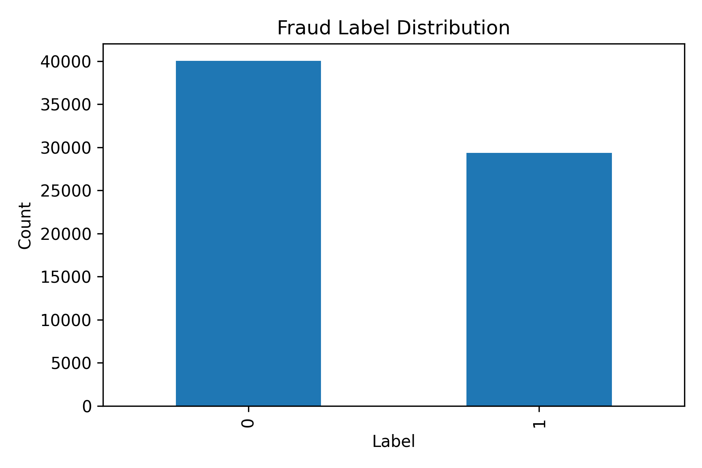

# 🛡️ FREUID Challenge 2026 - Identity Document Fraud Detection using Deep Learning 


---

# Overview

This project presents a complete Deep Learning pipeline for the **FREUID Challenge 2026 – Identity Document Fraud Detection Competition**.

The objective is to automatically distinguish between **genuine identity documents** and **fraudulent/manipulated identity documents** using convolutional neural networks and transfer learning.

The project includes:

- Image preprocessing
- Dataset preparation
- CNN-based fraud detection
- Transfer Learning (EfficientNetB0)
- Model evaluation
- ROC Analysis
- APCER/BPCER computation
- Kaggle submission generation
- Automatic visualization generation
- Model saving
- Prediction reports

---

# Dataset

The dataset consists of identity document images.

## Training Images

```
train/train
```

## Additional Training Images

```
train_sample/train_sample
```

## Testing Images

```
public_test/public_test
```

## Labels

```
train_labels.csv
train_sample_labels.csv
```

## Sample Submission

```
sample_submission.csv
```

---

# Project Structure

```
Fraud Prediction
│
├── the-freuid-challenge-2026-ijcai-ecai
│      │
│      ├── train
│      ├── train_sample
│      ├── public_test
│      ├── train_labels.csv
│      ├── train_sample_labels.csv
│      └── sample_submission.csv
│
├── fraud_results
│      │
│      ├── fraud_best_model.keras
│      ├── fraud_final_model.keras
│      ├── fraud_final_model.h5
│      ├── fraud_training_history.csv
│      ├── fraud_metrics.json
│      ├── fraud_classification_report.csv
│      ├── fraud_validation_predictions.csv
│      ├── fraud_submission.csv
│      ├── fraud_result_summary.txt
│      ├── fraud_label_distribution_graph.png
│      ├── fraud_training_accuracy_graph.png
│      ├── fraud_training_loss_graph.png
│      ├── fraud_auc_graph.png
│      ├── fraud_confusion_matrix_heatmap.png
│      ├── fraud_prediction_score_distribution.png
│      ├── fraud_test_prediction_distribution.png
│      └── fraud_roc_curve.png
│
└── Fraud_Detection.ipynb
```

---

# Methodology

The complete pipeline follows these stages.

## 1. Dataset Loading

- Load training labels
- Load sample labels
- Load test IDs
- Verify image paths

---

## 2. Image Preprocessing

Each image is

- Read from disk
- Resized to **224×224**
- Converted into RGB
- Normalized between 0 and 1

---

## 3. Data Augmentation

To improve generalization, the following augmentations are applied:

- Horizontal Flip
- Rotation
- Zoom
- Contrast Adjustment

---

## 4. Deep Learning Model

The project uses

**EfficientNetB0**

as the feature extractor.

Architecture:

```
Input Image
      │
Data Augmentation
      │
EfficientNetB0
      │
Global Average Pooling
      │
Dropout
      │
Dense Layer
      │
Dropout
      │
Sigmoid Output
```

---

## 5. Loss Function

Binary Cross Entropy

---

## 6. Optimizer

Adam Optimizer

Learning Rate:

```
0.0005
```

---

## 7. Callbacks

The training uses

- Early Stopping
- Model Checkpoint
- Reduce Learning Rate on Plateau

---

# Training Workflow

```
Images
   │
Resize
   │
Normalization
   │
Data Augmentation
   │
EfficientNetB0
   │
Feature Extraction
   │
Dense Layers
   │
Fraud Score
```

---

# Performance Metrics

The model computes

- Accuracy
- ROC-AUC
- Confusion Matrix
- Precision
- Recall
- F1 Score
- APCER
- BPCER

---

# Generated Results

The project automatically generates the following.

## ✔ Training History

```
fraud_training_history.csv
```

---

## ✔ Model Files

```
fraud_best_model.keras

fraud_final_model.keras

fraud_final_model.h5
```

---

## ✔ Classification Report

```
fraud_classification_report.csv
```

---

## ✔ Metrics

```
fraud_metrics.json
```

---

## ✔ Validation Predictions

```
fraud_validation_predictions.csv
```

---

## ✔ Competition Submission

```
fraud_submission.csv
```

---

## ✔ Summary Report

```
fraud_result_summary.txt
```

---

# Visualizations

The notebook automatically generates several visualizations.

---

## Dataset Distribution



Shows the distribution of genuine and fraudulent samples.

---

## Training Accuracy

```
fraud_training_accuracy_graph.png
```

Displays training and validation accuracy.

---

## Training Loss

```
fraud_training_loss_graph.png
```

Displays convergence of the model.

---

## ROC Curve

```
fraud_roc_curve.png
```

Illustrates discrimination capability of the model.

---

## Confusion Matrix

```
fraud_confusion_matrix_heatmap.png
```

Shows classification performance.

---

## Validation Prediction Distribution

```
fraud_prediction_score_distribution.png
```

Visualizes fraud probability scores.

---

## Public Test Prediction Distribution

```
fraud_test_prediction_distribution.png
```

Displays score distribution on unseen test data.

---

## AUC Curve

```
fraud_auc_graph.png
```

Shows AUC progression during training.

---

# Output Files

| File | Description |
|------|-------------|
| fraud_best_model.keras | Best validation model |
| fraud_final_model.keras | Final trained model |
| fraud_final_model.h5 | HDF5 model |
| fraud_metrics.json | Evaluation metrics |
| fraud_training_history.csv | Epoch history |
| fraud_classification_report.csv | Classification report |
| fraud_validation_predictions.csv | Validation predictions |
| fraud_submission.csv | Competition submission |
| fraud_result_summary.txt | Final project summary |

---

# Technologies Used

- Python
- TensorFlow
- Keras
- NumPy
- Pandas
- Matplotlib
- Scikit-Learn
- OpenCV

---

# Evaluation Metrics

The project evaluates

- Accuracy
- Precision
- Recall
- F1 Score
- ROC-AUC
- APCER
- BPCER

which are suitable for fraud detection systems and identity verification tasks.

---

# Future Improvements

Possible enhancements include

- Vision Transformer (ViT)
- ConvNeXt
- EfficientNetV2
- Ensemble Learning
- Test Time Augmentation
- Self-Supervised Pretraining
- Attention Mechanisms
- Explainable AI using Grad-CAM
- Mixed Precision Training
- Hyperparameter Optimization
- Model Ensembling for Kaggle

---

# Applications

This project can be adapted for

- Digital KYC
- eKYC Verification
- Passport Verification
- Aadhaar Verification
- Driving License Verification
- Identity Fraud Detection
- Financial Institutions
- Banking
- FinTech
- Border Control
- Airport Security
- Online Customer Verification

---

# Installation

Install the required libraries:

```bash
pip install tensorflow
pip install keras
pip install numpy
pip install pandas
pip install matplotlib
pip install scikit-learn
pip install opencv-python
```

---

# Running the Project

Run the notebook:

```
Fraud_Detection.ipynb
```

The notebook automatically

- Loads the dataset
- Trains the model
- Evaluates performance
- Saves the best model
- Generates all graphs
- Creates the Kaggle submission file

---

# Author

**Sagnik Patra**

M.Tech Computer Science & Engineering

Deep Learning • Computer Vision • Machine Learning • Artificial Intelligence

---

# License

This project is intended for educational and research purposes. The dataset remains subject to the FREUID Challenge competition terms and licensing conditions.
